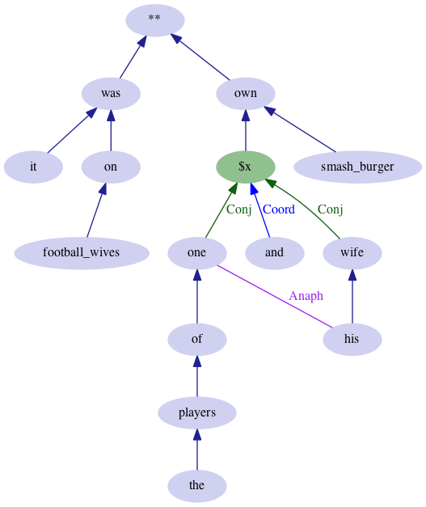
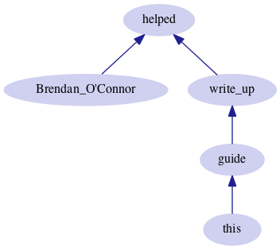
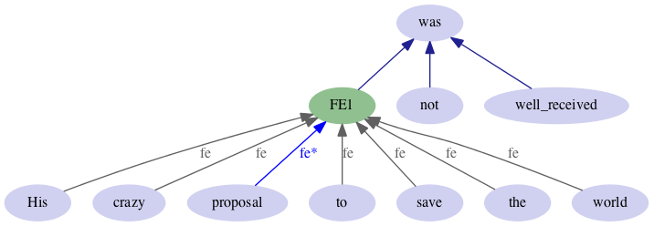
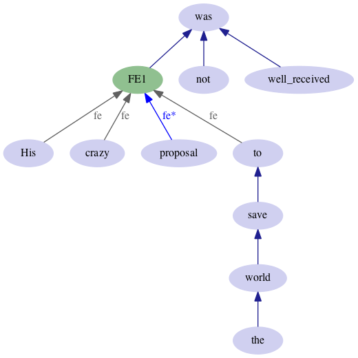
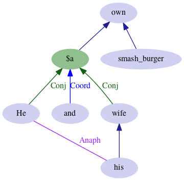
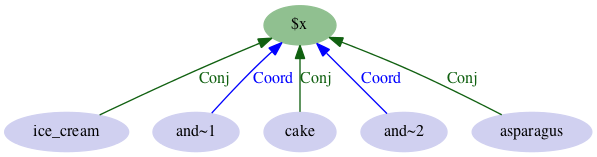
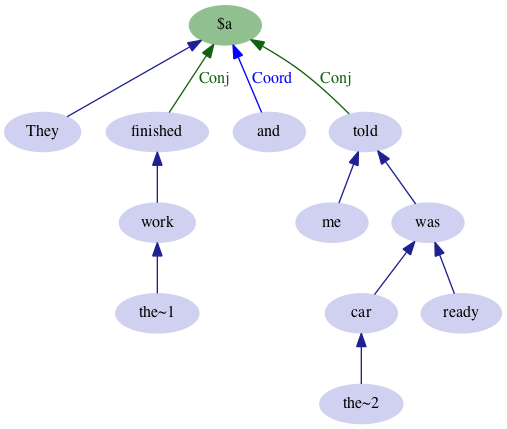
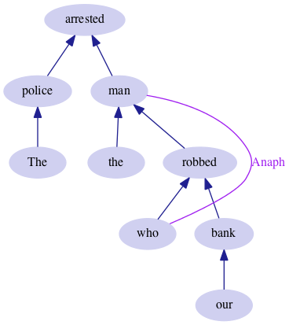

# FUDG-GFL Annotation Guidelines 1.3

Chris Dyer  
Brendan O’Connor  
Nathan Schneider  
David Bamman  
Noah A. Smith

*Document history:*  
2013-11-09: version 1.3: updated Multiwords; note about nonrestrictive relative clauses; Verb complexes: Quasi-modals  
2013-10-26: version 1.2: Contractions  
2013-09-30: version 1.1: Nesting and the Substitution Principle  
2013-09-22: version 1.0


> I mistrust all systematizers and I avoid them. The will to a system is a lack of integrity.
> ― Friedrich Nietzsche

```bash
I~1 > mistrust** < (all > systematizers)
I~2 > avoid < them
I~1 = I~2
$x :: {mistrust avoid} :: {and}
The > will < to < (a~1 > system)
will > is** < (a~2 > lack) < of < integrity
[Friedrich Nietzsche]**
```

This document is about two related things.

1. An enhanced syntactic annotation scheme built on unlabeled dependencies, which we call **Fragmentary Unlabeled Dependency Grammar (FUDG)**.

2. A lightweight notation for describing annotations over graph fragments, which we call **Graph Fragment Language (GFL)**.

This document introduces the mechanics of FUDG/GFL and specifies basic annotation conventions for English. A recent paper [(Schneider et al. 2013)](http://www.cs.cmu.edu/~nschneid/fudg.pdf) offers additional context and discussion.

- [Project home](http://www.ark.cs.cmu.edu/FUDG/)
- [Software](http://github.com/brendano/gfl_syntax/)

## Overview

Statistical learning enables the development of accurate syntactic parsers given the right kind of example parses as training data. For best performance, “the right kind” of data is (a) large, and (b) as similar to the target data as possible—similar in genre/dialect/style, topic/vocabulary, etc. But extensive high-quality detailed linguistic annotation for every language variety is out of the question. To make large-scale annotation projects more manageable/less costly, we therefore propose a syntactic *representation*, FUDG, that is simple and customizable to the needs and abilities of annotators.

FUDG is used to encode syntactic dependency structures. A **dependency parse** is a tree or tree-like structure representing syntactic head-modifier relationships (directed edges) between lexical items in the sentence (nodes). A traditional “vanilla” (CoNLL-style) dependency tree assumes that (a) every token has its own lexical node in the parse, (b) the parse forms a rooted tree (possibly with an additional root node), and (c) there are no other nodes in the parse. The FUDG representation relaxes some of these assumptions for greater flexibility in syntactic annotation. Extensions include:

1. multiwords—lexical nodes may contain multiple tokens,
2. coordination nodes—coordinate structures can be expressed unambiguously, and
3. anaphoric (coindexation) edges.

Additionally, annotations are different in scope than often found in treebanking efforts:

* **Annotations can be partial.**  Many tokens, such as disfluencies, discourse markers, emoticons, vocatives, and punctuation, can be considered independent units of analysis or omitted from the parse entirely.

* **Multiple disconnected islands or fragments are OK.**  If the input juxtaposes multiple sentences/syntactic units connected only at a pragmatic or discourse level, they can be marked as separate “utterances.”

* **The level of structural granularity is not fixed.**  An annotation may group together nodes without fully elaborating the dependencies among them.

As a general principle, we suggest that if part of a sentence’s syntax is difficult or contested, it’s better to leave that part the annotation **underspecified**.  The point is to record phenomena that we can train parsers to do.


To make these ideas more concrete, we will examine a sentence that illustrates the facets of our text-based annotation language.  After detailing these facets in turn, we will give conventions for some specific syntactic phenomena in English.


## Example

The Graph Fragment Language (GFL) facilitates the creation of dependency trees and FUDG graphs with a simple and intuitive annotation language.  It is a human-editable textual alternative to an annotation GUI.  For example:

> @ciaranyree it was on football wives , one of the players and his wife own smash burger

```
it > was** < on < [football wives]
one < of < (the > players)
his > wife
$x :: {one wife} :: and
$x > own** < [smash burger]
his = one
```

This represents the following node-word graph:



Note that the graph does not encode word order, so it should be thought of as supplementing (rather than replacing) the original sentence.

The specifics of the FUDG components of this annotation and their GFL notation will be elaborated below.

## Representation

A FUDG annotation represents a data structure containing:

* **lexical nodes** (disjoint subsets of input tokens; every lexical node maps to one or more tokens, and every token is included in 0 or 1 lexical nodes),
* **coordination nodes**,
* **fudge nodes**,
* an optional **root node**,
* **anaphoric edges** (undirected), and
* directed **syntactic edges** between nodes (mostly untyped, though there are special kinds of edges into coordination nodes and fudge nodes).
  - Apart from fudge node membership edges, the graph must not have cycles, and a node may have an out-degree of at most 1. Thus, the directed edge graph will be a tree or forest.

GFL defines ASCII notation for all of these components.

Currently, GFL cannot distinguish types of syntactic dependencies (e.g., subject, object, modifier), though this may be supported in the future.

Tokenization is assumed to be specified in the input. GFL does not assume any particular tokenization scheme.

## Graph Fragments

The core of GFL is a list of *graph fragments*, which indicate a set of words, nodes, and edges between them.  Using the words’ and nodes’ unique identifiers, the GFL interpreter merges together the fragments into one graph.

This means there are many ways to represent the same graph.  This gives an annotator flexibility to express it in the most natural way possible—even preserving original phrase orderings while fully describing the dependency structure.

### Indicating dependency edges

Left and right arrows (marked with `<` or `>`) are used to indicate a dependency, pointing **from** the dependent **to** the head.  For example,

> I saw the cat

could be represented as the list of all the dependency edges,

	saw < I
	saw < cat
	cat < the

It is always possible to completely describe a dependency graph with a long list of pairs, but there are also terser shortcuts.  The following seven notational variants are completely equivalent (and more equivalents are possible):

1. `a < b`  
   `a < c`

2. `b > a`  
   `c > a`

3. `a < {b c}`

4. `{c b} > a`

5. `b > a < c`

6. `(a < b) < c`

7. `c > (b > a)`

### Associativity and Precedence in Chains

Arrows can be chained together to form longer chains, and ambiguities resolved with parentheses. The **head** of an expression enclosed in (parentheses) is the only element that becomes a head or dependent.  This is useful to naturally preserve surface orderings.  For example, the *"I saw the cat" *example could have been written as:

	I > saw < (the > cat)

When working out the meanings of chains, keep in mind that right arrows associate to the left, i.e., `a > b > c` is the same as `(a > b) > c`, and left arrows associate to the right, i.e., `a < b < c` is the same as `a < (b < c)`.

The double-headed expression **`a < b > c`** violates the single-parent constraint of our syntactic formalism, and is thus disallowed by the parser.

Theoretical note: For a sentence with a “projective” dependency structure, it’s possible to describe all its simple dependencies on a single line with the word order preserved, just using arrows and nesting.  These correspond (approximately) to the shift-reduce actions of a left-to-right dependency parser.

## Multiwords

It is often advantageous to treat multiple tokens as a single virtual word. This can be done by enclosing the words in [square brackets]. For example:

> **Brendan O’Connor** helped **write up** this guide.

    [Brendan O’Connor] > helped < [write up] < (this > guide)

The formalism makes no commitment to the surface ordering within a square bracket construct. The same graph description would work for:

> Brendan O’Connor helped **write** this guide **up**.

   

Multiwords allow an annotator to punt on expressions that are best understood as idiosyncratic phrases or that have forbiddingly complicated compositional analyses, while still describing their relationship with the rest of the sentence (e.g. [putnam_catenae_examples](https://github.com/brendano/gfl_syntax/blob/master/anno/putnam_catenae_examples.anno) from Osborne et al 2011).

We generally reserve multiwords for the following cases that are semantically coherent but not easy to analyze syntactically:

  1. multiword proper names: `[Brendan O’Connor]`
  2. verb-particle constructions: `[wake up]`
  3. multiple input tokens conventionally written as one word: `[over priced]`
  4. highly noncompositional compounds and foreign expressions: `[class act]`, `the > [lost and found]`, `[post hoc]`
  5. syntactically difficult idioms: `[let alone]`, `[had better]` (see [quasi-modals](#verb-complexes))

But we try to decompose idioms that have a plausible (if atypical) syntactic analysis:

    kick < (the > bucket)
    I > (kid < you) < not
    be < on < (the > verge < of < victory)

## Fudge Expressions (FEs)

Fudge Expressions (FEs) let the annotator assert that a subset of words forms a **dependency subgraph** without specifying any or all of its internal syntactic structure. Reasons to leave some of the structure un(der)specified might include:

* *Indifference:* the annotation project may wish to focus effort on certain syntactic phenomena and disregard others

* *Uncertainty:* e.g. if the sentence is ambiguous or if the annotation guidelines are yet not sufficiently mature to give a clear answer

Whatever the motivation, a formal encoding of underspecification will allow annotators to further elaborate the syntax at a later time.

FEs are indicated by enclosing a sequence of words or other annotations in parentheses without arrows between them, e.g.:

    (in parentheses like this)

The words need not be contiguous in the input.

The head of the subphrase may optionally be marked with a `*` following the head token: 

    (in* parentheses with star on the head)

Marking the phrase head is strongly recommended since it permits the GFL parser to check for annotation consistency.

Unlike multiwords, which are used to suggest a noncompositional interpretation of the words, FEs are an annotation convenience that let the annotator focus on, e.g., certain syntactic phenomena without worrying about annotating the complete syntax of a sentence.  (They also seem to be related to Osborne et al’s theory of "catenae.")

> His crazy proposal to save the world was not well received

- Partial annotation using FEs (no internal structure at all):

        (His crazy proposal* to save the world) > (was < not) < [well received]

	

- Notational variant of previous annotation:

	    (His crazy proposal* to save the world)
        proposal > (was < not) < [well received]

- Yet another notational variant of the previous annotation (strongly dispreferred):

	    (His crazy proposal to save the world)
        proposal > (was < not) < [well received]

FEs can also bracket sets of words that have some internal structure annotated:

- Partial internal structure with FEs:

        (His crazy proposal* to < save < (the > world)) > was
        not > was < [well received]

	

- Notational variant of previous annotation:

        (His crazy proposal* to) > (was < not) < [well received]
        to < save < (the > world)

FEs that are inconsistent with the rest of the dependency annotations will cause an error. Example:

    (crazy proposal* to) > (was < not) < [well received]
    to < save < (the > world)
    crazy > his

The third line is an error, as it implies *crazy* has a head outside the fudge expression.

The head-marking may be recursively applied to a nested FE. This implies that the same word heads both the inner and outer FEs. E.g., `(a (b* c)*)` is equivalent to `(b* c) (a b*)` and therefore compatible only with `a > b < c`.

FEs have an **underspecification semantics**: an FE implies constraints on the set of possible trees.  Let *W* be the set of words in an FE clause.  The FE implies that *W forms a connected subgraph*.

* Because the graph is a tree, this entails that *W* contains some word that dominates all the others (least common subsumer). This word, *LCS(W)*, may be identified by starring it. The head of every word in *W* except for *LCS(W)* is also in *W*.

* *W* is not necessarily a full *subtree*. That is, words in *W* may have additional dependents not in *W*.

* `b < (a c)` is compatible only with `b < a < c` or `b < c < a` because `a` and `c` must form a connected subgraph. By contrast, `(a b* c)` is also compatible with `a > b < c`.

Examples for graph `a > b < c < d`  (having `b` as root):

1. `(a b c d)`    is compatible

2. `(a b c)`     is compatible: `c < d` is allowed as a dangling subtree

3. `(b c)` and `(c d)` are compatible

4. `(b d)`	is NOT compatible:  not connected (missing `c`)

5. `(a c)`	is NOT compatible:  not connected (missing `b`)

The FE conditions also hold for the case of optional use of parentheses for simple disambiguation of fully specified arrow relations: #1 should be true via some cute little induction proof off the binary base case, and #3 should be true because a node can have only one head.

**Nesting**: If a fudge expression contains subexpressions, the head of the subexpression is taken to be a member of the fudge expression. E.g., `(a > b c)` or its notational variant `((a > b) c)` or `((a b*) c)` is equivalent to having these two clauses: (#1)

	a > b
	(b c)

Note that it is NOT equivalent to (#2)

	a > b
	(a b c)

In general, GFL observes the following **Substitutability Principle**: If a directed dependency fragment contains a parenthesized subexpression, moving the subexpression to another clause and substituting its internal head (if known) will yield an equivalent FUDG annotation.

Here are some nested expressions and their decompositions following from substitutability:

    (a > b) > c         a > b  b > c
    a > (b > c)         a > c  b > c
    ((a > b) c)         a > b  (b c)
    (a b* c) > d        (a b* c)  b > d
    ((a b* c) d)        (a b* c)  (b d)
    {(a > b) c} > d     a > b  {b c} > d
    (a (b c)* d) > e    (a (b c)* d)  (b c) > e
    a > (b c* d)        a > c  (b c* d)

The last of these—an external attachment to a fudge expression—may be subtle, but the Substitutability Principle precludes an analysis like `a > b > c < d` from being compatible with `a > (b c* d)`. It would not be compatible with `a > (b c d)`, either, because an outside node attaching to an FE in the annotation is required to attach in any compatible full analysis to the highest member of the FE. Note that `a > (b c d)` and `(a (b c d)*)` are equivalent.

## Coordination nodes

Coordination represents a particular problem in pure dependency formalisms. We handle them by permitting the introduction of **coordination nodes** using a special ternary operator.

> He and his wife own smash burger

```bash
$a :: {He wife} :: and
wife < his
$a > own < [smash burger]
his = He
```



The coordination node binds to the word *"and"*, and its node children are both *“He”* and *“wife”*.  This is described with the double-colon `::`  ternary operator. `$a` is the name of the node in the GFL.  It must begin with a dollar sign (`$`).

If there are multiple coordinator words, they should all be listed, except for punctuation.

> ice cream and~1 cake and~2 asparagus

```bash
$x :: {[ice cream] cake asparagus} :: {and~1 and~2}
```



Presumably, to use them correctly, we would put in smart features into a parser or semantic analyzer that know how to reach through coordination nodes. The coordination node allows us to attach material that is headed by the conjoined phrase, such as a shared subject:

> They " finished " the~1 work and told me the~2 car was ready .

```bash
They > $a
$a :: {finished told} :: {and}
finished < (the~1 > work)
told < me
told < (the~2 > car > was < ready)
```



**Multiword conjunctions.** Correlative conjunctions (<i>either...or</i>, *both...and*, etc.) and expressions like *as well as* are treated as multiwords:

> You may bring either food or drink , as well as a gift .

```bash
$o :: {food drink} :: {[either or]}
$a :: {$o (a > gift)} :: {[as well as]}
You > may < bring < $a
```

## Contractions

If contractions are not split as part of the tokenization, 
they function in the parse as the head would if split. 
For example, *I’m* and *didn’t* count as verbs.
This sometimes has subtle implications:

> I’m hungry and wanting to eat

```bash
$a :: {hungry wanting} :: {and}
I’m < $a
wanting < to < eat
```

> I’m hungry and want to eat

```bash
$a :: {I’m want} :: {and}
I’m < hungry
want < to < eat
```

In the first case, the verbal clitic *’m* heads both *hungry* and *wanting*.
In the second case it heads only *hungry*, 
so the parse does not encode any relationship
between *want* and its implied subject *I*.

## Verb complexes

**Modals and other auxiliaries are roots/heads—main verbs aren’t.**  The two possibilities we considered are “Stanford Dependency/LFG”-style and “Chomsky”-style.  We are using the second style: the first auxiliary/modal is the root, and the main verb depends on it.  Multiple verbs create a chain.  The subject on the left connects to the first verb, while the last verb gets the object.

- `Ingrid > did < have < it`

- `Ingrid > would < have < been < there`

- `Ingrid > (did < not) < have < it`

- `Ingrid > didnt < have < it`

For long and tricky-to-analyze verb chains, consider FEs:

- `Ingrid > (would not have) < it`

- `Ingrid > (would not have had) < it`

**Infinitival _to_** is treated as the **head** of its non-finite verb:

    I > will < try < to < (love < you) < more

**Quasi-modals** are usually decomposed:

    have < to < announce
    ought < to < announce
    would < like < to < announce
    (would < rather) < announce

An exception is *had better*, which is treated as a multiword because *had* does not function morphosyntactically as a perfect auxiliary or main verb:

    you > [had better] < believe < it

## Existentials

Existential *there* counts as a subject:

    There > are < {cookies (in < (my > office))}

## Anaphora and Relative Clauses

GFL supports special **undirected node-node relations** for explicit anaphora. Consider this example:

> The police arrested the man who robbed our bank.

    The > police > arrested < man
    the > man < robbed
    who > robbed < (our > bank)
    who = man
    


Semantically, the *man* is both the object of *arrest* **and** the subject of *robbed*. But, syntactically, the complementizer *who* occupies the subject position of the RC. We therefore make the semantics of the semantic link clear by writing: `who = man`. The head of the embedded clause (the verb *robbed*) also serves as the dependent of the nominal head (*man*).

Nonrestrictive relative clauses (*The police arrested the man, who robbed our bank*) are analyzed like their restrictive counterparts.

Sometimes the relative pronoun is the object of a preposition, which may be stranded or fronted:

> He is the guy **who** I worked **with**.

    He > is < (the > guy < worked)
    I > worked < with < who
    who = guy

> He is the guy **with whom** I worked.

    He > is < (the > guy < worked)
    I > worked < with < whom
    whom = guy

If there are multiple coreferent anaphora within the input, the anaphoric links should be as local as possible.

> Is he the one who impaled himself ?

    he > is < (the > one) < impaled
    who > impaled < himself
    who = one
    who = himself

The subject and predicate of a copular construction, such as *he* and *one* above, are **not** joined with an anaphoric link, even if one or both are pronouns.

If there is no overt relative pronoun, the head of the relative clause is attached with a directed arc. Compare:

> She is the one whom/that/∅ I like.

    she > is < (the > one)
    one < (I > like)

plus

- **whom:**
     
        like < whom
        whom = one

- **that:**

        like < that
        that = one

- **∅:** (no additional annotation fragments)


**Nominal relative clauses, pseudo-clefts, and other Wh- clauses.** Besides the adnominal relative clauses discussed above, there are several kinds of clauses with similar structures; some are illustrated with sentences from Quirk et al. (pp. 1050–1059):

> She asked me *who would look after the baby*.

> I took *what they offered me*.

> Quality is *what counts most*.

> They didn’t know *what (a) crime he had committed*.

A detailed treatment of *wh-* expressions is out of scope here, but the general principle is that if no other noun phrase is available for an anaphoric link, the relative pronoun/<i>wh-</i>word is treated as the head of the clause. Thus:

    asked < who < would < look < after < (the > baby)

    took < what < (they > offered < me)

    Quality > is < what < counts < most

but

    know < crime
    he > had < committed < what
    what = crime

**Anaphoric personal & possessive pronouns.** These should be linked to their antecedent, if available:

> 2pac was not a " rapper " he was so much more than that . He was a Revolutionary .

    2pac = he = He

Where an entity is referred to with multiple pronoun tokens, these should be linked together (even if there is no overt antecedent). The anaphor can be linked even if the token contains additional material besides the pronoun:

> Found the scarriest mystery door in my school . I'M SO CURIOUS

    my = I'M

> I think I'm a wait an hour

    I = I'm

**Appositives.** Appositives/certain parentheticals are dependents of a nominal head, *and also* anaphorically linked to it: (NOTE: In some instances, noun-noun compounds may be confusable with appositives. The general diagnostic is that apposition is the placement of two complete NPs next each other, while noun-noun compounding is the use of one noun to modify another.)

> Bob , the CEO , was dissing ice cream ( my favorite dessert ! ) .

    Bob > was > dissing < [ice cream]
    Bob < (the > CEO)
    [ice cream] < (my > favorite > dessert)
    Bob = CEO
    [ice cream] = dessert

> Your friend Brainerd is in trouble.

    (Your > friend < Brainerd) > is < [in trouble]
    friend = Brainerd

***Do-* and *so-* anaphora.** These have a verbal antecedent:

> Ingrid likes cheese and so does Brendan .

```bash
Ingrid > likes < cheese
Brendan > [so does]
$a :: {likes [so does]} :: {and}
[so does] = likes
```

**Sluicing:** 

> J can play something, but I don’t know what.

```bash
J > can < play < something
I > don’t < know < what
what = something
$b :: {can don’t} :: {but}
```

**Tag questions** count as a separate utterance whose parts are anaphorically linked to the main sentence: 

> She likes cookies, doesn’t she?

    She > likes** < cookies
	doesn’t** < she
    doesn’t = likes
    she = She

GFL does not currently mark non-anaphoric coreference or null anaphora (such as control relations, imperatives, or pro drop).

### Why special marking for anaphora?

In the relative clause example just given, the same referent (<i>man</i>) occupies two semantic roles, as the agent of *robbed* and as the patient of *arrested*. Since GFL is a *graph* language, we could mark these roles explicitly with standard directed dependencies. However, if we did this, then the set of directed edges would no longer form a forest or tree (i.e., a single node, *man*, would have *two* parents). Since most natural language syntax seems to adhere to a tree/forest constraint, we provisionally adopt it as a hard constraint for annotation. However, having extra undirected anaphoric edges lets us annotate important and useful coreference relations.

With this established we state an important annotation guideline:

**The graph determined by the set of *directed dependency edges* should be a tree or forest**. That is, in the graph the annotator creates, **every node has at most one head**—i.e., at most one outbound arrow.  (In our convention, arrows point *up* the tree.  A node may have many children, i.e. inbound arrows.)  (Fudge expression membership edges, though directed, are excluded from this constraint: a lexical node may belong to multiple overlapping FEs.)

Now consider the case: 

> I wonder when Nic Cage is going to film "~1 Another Something~1 Something~2 Las Vegas "~2 .

We treat the relativizer *when* as the head of the embedded clause (admittedly obscuring the adjunct function of the time being questioned):

    I > wonder < when < is
    [Nic Cage] > is < [going to] < film
    film < ["~1 Another Something~1 Something~2 Las Vegas "~2]

The same structure would be used for subordinators *whether* and *if*.

## Possessives and predeterminers

The possessive *’s* clitic (if tokenized) is the head of the noun phrase that precedes it. A predeterminer modifies the noun phrase head:

> all the king ’s horses

    all > (the > king > ’s > horses)

## Comparative constructions

Though these tend to involve multiple correlated parts, we will ignore this correlation:

> Brendan weighs more than Ingrid.

    Brendan > weighs < more < than < Ingrid

> Brendan weighs more than Ingrid does.
> Brendan weighs more than does Ingrid.

    Brendan > weighs < more < than < does < Ingrid
    does = weighs

> Brendan eats more cabbage than Ingrid.

    Brendan > eats < (more > cabbage)
    eats < than < Ingrid

> Brendan eats as much cabbage as Ingrid.

    Brendan > eats < (as > much > cabbage)
    eats < as < Ingrid

> Brendan eats the same amount of cabbage as Ingrid.

    Brendan > eats < amount < as < Ingrid
    {the same} > amount < of < cabbage

## Rooted fragments & discourse issues

`**` serves as an optional top-level root marker. It is usually implicit, but can be provided to require that an expression *not* be headed by any word in the sentence.

Though we have been calling the input a “sentence,” depending on the annotation project it may not be a linguistic sentence. The input may contain multiple “utterances,” which we use loosely to mean any unit that ought to form its own fragment in the full analysis. Interjections and emoticons can be considered separate utterances. If multiple utterances are present in the input, the head of each—typically the verb—should be marked with `**`.

In a full (not underspecified) analysis, every utterance will be a directed subtree (possibly with additional undirected links), with its head attached to the special node `**`.

**Discourse connectives.** “And …,” “though”, “however,” “first of all,” etc. are treated as independently rooted elements if they are kept in the analysis at all.

**Null copula constructions.** If there is no copula, the predicate nominal/adjective generally heads the utterance:

> she the same size as the bop

    she > size

**Sentence-level adverbs.** “Obviously,” “fortunately,” “probably,” and the like (which convey the speaker’s attitude towards the content of the clause) should head the clause they apply to:

> She is **obviously** going to win .  
> **Obviously**, she is going to win .

    obviously** < (She > is < going < to < win)

> she **probably** the same size as the bop

	she > size > probably**
	{the same} > size < as < (the > bop)

## Measures

We have developed quantitative measures of the extent to which an annotation underspecifies the full parse tree. These measures are called *commitment* and *promiscuity*, and are useful in measuring inter-annotator agreement. For details, see Schneider et al. (2013).

## Related work

Dependency grammar is an well-established tradition in theoretical and computational syntax; see Nivre (2005) for a review. The formalism described here also has many similarities to the dependency-like syntactic analyses in the sentence diagramming tradition that was popular as a pedagogical language learning tool from the 19th to mid-20th century (Kellogg and Reed 1877).  The GFL formalism can represent a substantial subset of the analyses in [this introduction](http://www.utexas.edu/courses/langling/e360k/handouts/diagrams/diagram_basics/basics.html) to the Reed-Kellogg system; see also Kolln and Funk (2005).  In 2010, Brendan ran a quick Mechanical Turk survey which found 80 people who said they have experience with sentence diagramming.  This could be very useful.  (Some more background in [this unimplemented proposal](http://brenocon.com/sentence_diagramming_proposal_2010.pdf).)

There are also similarities to the theory of “catenae,” which aims to generalize the idea of constituents; see Osborne et al. (2011), or [the Wikipedia page](http://en.wikipedia.org/wiki/Catena_(linguistics\)).

## References

Noam Chomsky (1981). *Lectures on Government and Binding: The Pisa Lectures*. Mouton de Gruyter.

Martha J. Kolln and Robert W. Funk (2005). *Understanding English Grammar*. Longman, 7th edition.

Joakim Nivre (2005). Dependency grammar and dependency parsing. MSI report 05133, Växjö University School of Mathematics and Systems Engineering, Växjö, Sweden. [[pdf]](http://stp.lingfil.uu.se/~nivre/docs/05133.pdf)

Timothy Osborne, Michael Putnam, and Thomas Groß (2012). Catenae: Introducing a novel unit of syntactic analysis. *Syntax* *15*(4), Dec.
[[journal version]](http://onlinelibrary.wiley.com/doi/10.1111/j.1467-9612.2012.00172.x/abstract)
[[manuscript]](http://psu-us.academia.edu/MikePutnam/Papers/899666/Catenae_-_Introducing_a_Novel_Unit_of_Syntactic_Analysis)

Randolph Quirk, Sidney Greenbaum, Geoffrey Leech, and Jan Svartvik (1985). *A Comprehensive Grammar of the English Language.* New York: Longman.

Alonzo Reed and Brainerd Kellogg (1877). *Higher Lessons in English*. [[free on Google Books]](http://books.google.com/books/about/Higher_Lessons_in_English.html?id=bHJMAAAAIAAJ) [[pdf]](http://books.google.com/books/download/Higher_Lessons_in_English.pdf?id=bHJMAAAAIAAJ)

Nathan Schneider, Brendan O’Connor, Naomi Saphra, David Bamman, Manaal Faruqui, Noah A. Smith, Chris Dyer, and Jason Baldridge (2013). A framework for (under)specifying dependency syntax without overloading annotators. *Proceedings of the Linguistic Annotation Workshop.*  [[conference version]](http://www.cs.cmu.edu/~nschneid/fudg.pdf) [[extended version]](http://arxiv.org/abs/1306.2091)